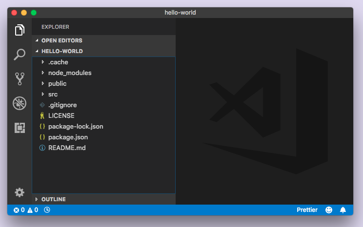
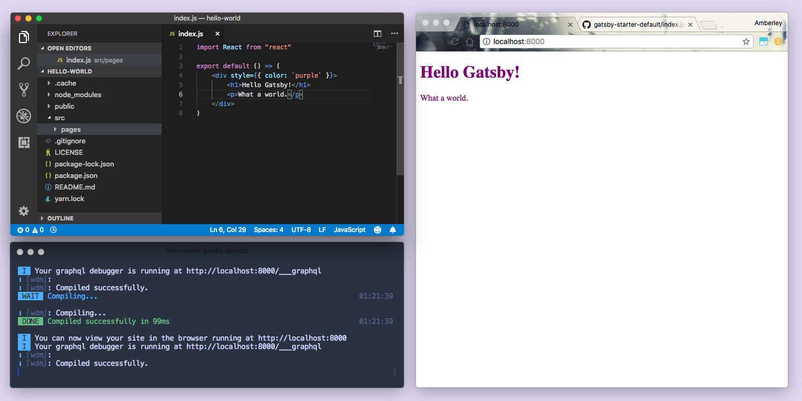
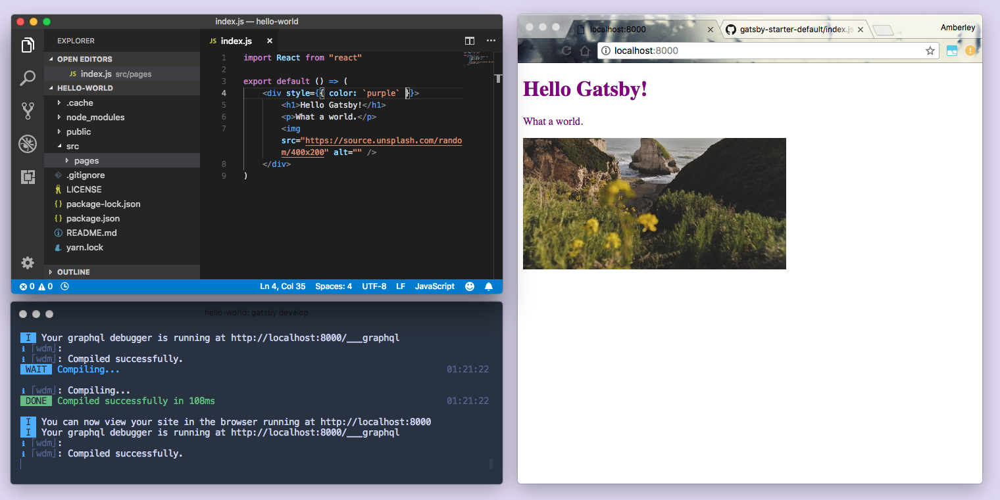
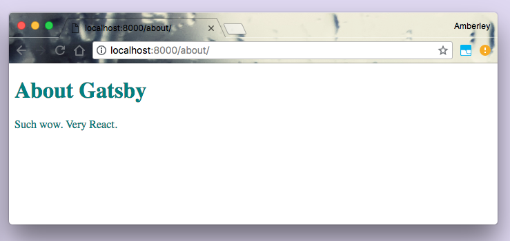
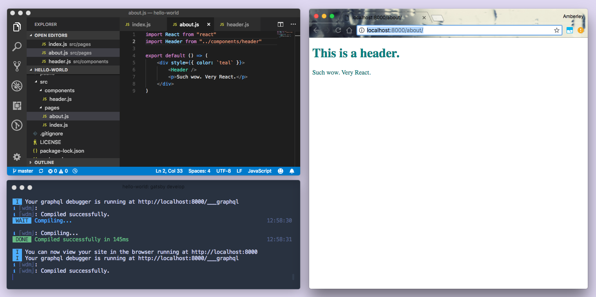
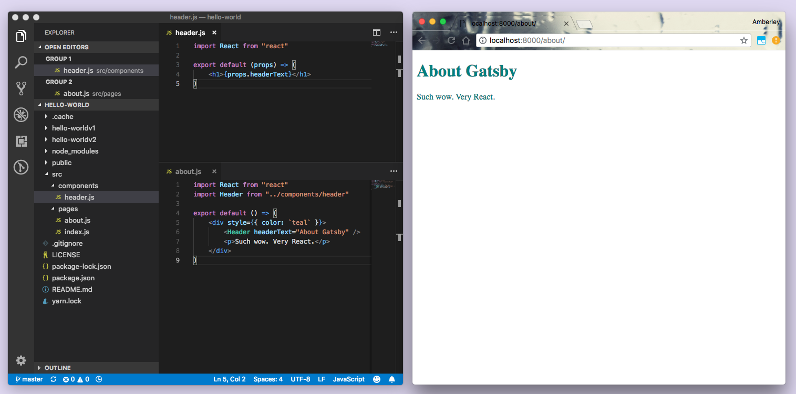
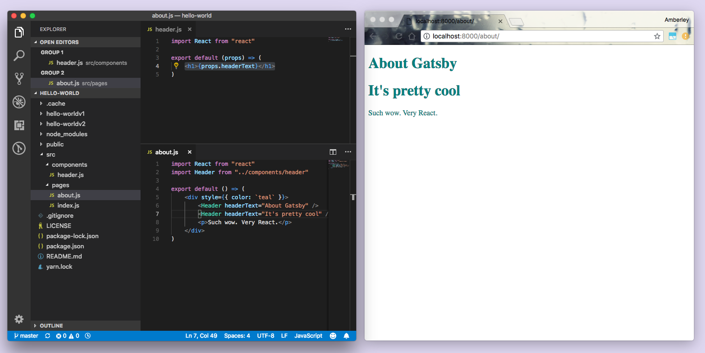
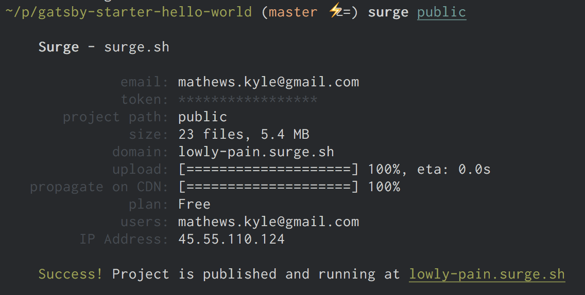

In de [**vorige sectie**](/tutorial/part-zero/) heb je je lokale ontwikkelomgeving voorbereid door de benodigde software te installeren en je eerste Gatsby-site te maken met behulp van de [**"hallo wereld"starter**](https://github.com/gatsbyjs/gatsby-starter-hello-world). Duik nu dieper in de code die door die starter is gegenereerd.

## Gatsby-starters gebruiken

In [**tutorial deel nul**](/tutorial/part-zero/) heb je een nieuwe site gemaakt op basis van de 'hallo wereld'-starter met de volgende opdracht:

```shell
gatsby new hallo-wereld https://github.com/gatsbyjs/gatsby-starter-hello-world
```

Wanneer je een nieuwe Gatsby-site maakt, kun je de volgende opdrachtstructuur gebruiken om een ​​nieuwe site te maken op basis van een bestaande Gatsby-starter:

```shell
gatsby new [SITE_MAP_NAAM] [URL_VAN_STARTER_GITHUB_REPO]
```

Als je aan het einde een URL weglaat, genereert Gatsby automatisch een site voor je op basis van de [**standaard starter**](https://github.com/gatsbyjs/gatsby-starter-default). Blijf voor dit gedeelte van de zelfstudie bij de "Hallo Wereld"-site die je al hebt gemaakt in tutorial deel nul.

### ✋ Open de code

Open in je code-editor de code die is gegenereerd voor je 'Hallo Wereld'-site en bekijk de verschillende mappen en bestanden in de map 'hallo-wereld'. Het zou er ongeveer zo uit moeten zien:



_Opmerking: Nogmaals, de hier getoonde editor is Visual Studio Code. Als je een andere editor gebruikt, ziet deze er wat anders uit._

Laten we de code bekijken die de startpagina aanstuurt.

> 💡 Als je je ontwikkelserver hebt gestopt na het uitvoeren van `gatsby develop` in het vorige gedeelte, start je deze nu opnieuw - tijd om enkele wijzigingen aan te brengen op de hallo-wereld site!

## Vertrouwd raken met Gatsby-pagina's

Open de map `/src` in je code-editor. Binnenin is een enkele map: `/pages`.

Open het bestand op `src/pages/index.js`. De code in dit bestand maakt een component met een enkele div en wat tekst - toepasselijk, "Hallo wereld!"

### ✋ Breng wijzigingen aan op de startpagina “Hallo wereld”

1. Wijzig de tekst "Hallo wereld!" In "Hallo Gatsby!" En sla het bestand op. Als je vensters naast elkaar staan, kun je zien dat je code- en inhoudsveranderingen vrijwel onmiddellijk in de browser worden doorgevoerd nadat je het bestand hebt opgeslagen.

<video controls="controls" autoplay="true" loop="true">
  <source type="video/mp4" src="./02-demo-hot-reloading.mp4"></source>
  <p>Sorry! Je browser ondersteunt deze video niet.</p>
</video>

> 💡 Gatsby gebruikt **hot reloading** om je ontwikkelingsproces te versnellen. Als je een Gatsby-ontwikkelserver uitvoert, worden de Gatsby-sitebestanden in de achtergrond "bekeken". Wanneer je een bestand opslaat, worden je wijzigingen onmiddellijk in de browser weergegeven. Je hoeft de pagina niet handmatig te vernieuwen of de ontwikkelingsserver opnieuw te starten - je wijzigingen worden direct weergegeven.

2. Nu kun je je wijzigingen een beetje zichtbaarder maken. Probeer de code in `src/pages/index.js` te vervangen door de onderstaande code en sla opnieuw op. Je ziet wijzigingen in de tekst: de tekstkleur is paars en de lettergrootte is groter.

```jsx:title=src/pages/index.js
import React from "react"

export default () => (
  <div style={{ color: `purple`, fontSize: `72px` }}>Hallo Gatsby!</div>
)
```

> 💡 In [**deel twee**](/tutorial/part-two/) van de tutorial zullen we meer vertellen over toepassen van styling in Gatsby.

3.  Verwijder de stijl van de lettergrootte, wijzig de tekst "Hallo Gatsby!" In een koptekst van niveau 1 en voeg een alinea toe onder de koptekst.

```jsx:title=src/pages/index.js
import React from "react"

export default () => (
  {/* highlight-start */}
  <div style={{ color: `purple` }}>
    <h1>Hallo Gatsby!</h1>
    <p>Wat een wereld.</p>
  {/* highlight-end */}
  </div>
)
```



4.  Voeg een afbeelding toe. (In dit geval, een willekeurige afbeelding van Unsplash).

```jsx:title=src/pages/index.js
import React from "react"

export default () => (
  <div style={{ color: `purple` }}>
    <h1>Hallo Gatsby!</h1>
    <p>wat een wereld.</p>
    {/* highlight-next-line */}
    
  </div>
)
```



### Wacht... HTML in ons JavaScript?

_Als je bekend bent met React en JSX, kunt je deze sectie overslaan._ Als je nog niet eerder met het React-framework hebt gewerkt, vraag je je misschien af ​​wat HTML doet in een JavaScript-functie. Of waarom we 'react' op de eerste regel importeren, maar het blijkbaar nergens gebruiken. Deze hybride "HTML-in-JS" is eigenlijk een syntax-extensie van JavaScript voor React, JSX genoemd. Je kunt deze tutorial volgen zonder eerdere ervaring met React, maar als je nieuwsgierig bent, is hier een korte inleiding ...

Neem het originele inhoud van het bestand `src/pages/index.js`:

```jsx:title=src/pages/index.js
import React from "react"

export default () => <div>Hallo wereld!</div>;
```

In puur JavaScript ziet het er meer zo uit:

```javascript:title=src/pages/index.js
import React from "react"

export default () => React.createElement("div", null, "Hallo wereld!")
```

Nu kun je het gebruik van import `'react'` herkennen! Maar wacht. Je schrijft JSX, geen pure HTML en JavaScript. Hoe leest de browser dat? Het korte antwoord: niet. Gatsby-sites worden geleverd met vooraf ingestelde tooling om je broncode om te zetten in iets dat browsers wel kunnen interpreteren.

## Bouwen met componenten

De startpagina waaraan je zojuist hebt bewerkt, is gemaakt door een paginaonderdeel te definiëren. Wat is precies een "component"?

In grote lijnen is een component een bouwsteen voor je site; Het is een zelfstandig stuk code dat een gedeelte van de UI (gebruikersinterface) beschrijft.

Gatsby is gebouwd met behulp van React. Als we het hebben over het gebruiken en definiëren van **componenten**, hebben we het echt over **React componenten** - op zichzelf staande stukjes code (meestal geschreven met JSX) die invoer kunnen accepteren en React elementen als uitvoer teruggeven die een sectie van UI beschrijven .

Een van de grote mentale sprongen die je moet maken wanneer je begint met het bouwen met componenten (als je al een ontwikkelaar bent), is dat je CSS, HTML en JavaScript nu nauw gekoppeld zijn en vaak zelfs in hetzelfde bestand leven.

Hoewel het een ogenschijnlijk eenvoudige wijziging is, heeft dit ingrijpende gevolgen voor hoe je denkt over het bouwen van websites.

Neem het voorbeeld van het maken van een aangepaste knop. In het verleden maakte je een CSS-klasse (bijvoorbeeld `.primary-button`) met je aangepaste stijlen en gebruikt je deze telkens wanneer je die stijlen wilt toepassen. Bijvoorbeeld:

```html
<button class="primary-button">Klik op mij</button>
```

In de wereld van componenten maak je in plaats daarvan een component `PrimaryButton` met je knopstijlen en deze gebruik je op je site zoals:

<!-- prettier-ignore -->
```jsx
<PrimaryButton>Klik op mij</PrimaryButton>
```

Componenten worden de basisbouwstenen van je site. In plaats van beperkt te zijn tot de bouwstenen die de biedt browser b.v. de `<button />` kun je eenvoudig nieuwe bouwstenen maken die naadloos aansluiten aan de behoeften van je projecten.

### ✋ Paginacomponenten gebruiken

Elk React-component gedefinieerd in `src/pages/*.js` wordt automatisch een pagina. Laten we dit in actie bekijken.

Je hebt al een `src/pages/index.js` bestand dat bij de "Hello World" starter is geleverd. Laten we een pagina over maken.

1. Maak een nieuw bestand aan in `src/pages/over.js`, kopieer de volgende code naar het nieuwe bestand en sla op.

```jsx:title=src/pages/over.js
import React from "react"

export default () => (
  <div style={{ color: `teal` }}>
    <h1>Over Gatsby</h1>
    <p>Such wow. Very React.</p>
  </div>
)
```

2.  Navigeer naar http://localhost:8000/over/.



Door simpelweg een React-component in het bestand `src/pages/over.js` te plaatsen, heb je nu een pagina die toegankelijk is via `/over`.

### ✋ Gebruik van sub-componenten

Stel dat de startpagina en de over-pagina beide behoorlijk groot zijn geworden en dat je veel dingen hebt herschreven. Je kunt subcomponenten gebruiken om de gebruikersinterface in herbruikbare stukken te splitsen. Beide pagina's hebben `<h1>` kopteksten - maak een component die een `Header` beschrijft.

1.  Maak de map `src/components` aan end in die map een bestand genaamd `header.js`.
2.  Voeg de volgende code toe aan het nieuwe `src/components/header.js` bestand.

```jsx:title=src/components/header.js
import React from "react"

export default () => <h1>Dit is een koptekst.</h1>;
```

3. Wijzig het bestand `over.js` om de component`Koptekst` te importeren. Vervang de `h1` markup door`<Header />`:

```jsx:title=src/pages/over.js
import React from "react"
import Header from "../components/header"; // highlight-line

export default () => (
  <div style={{ color: `teal` }}>
    <Header /> {/* highlight-line */}
    <p>Such wow. Very React.</p>
  </div>
)
```



In de browser moet de koptekst "Over Gatsby" nu zijn vervangen door "Dit is een koptekst." Maar je wilt niet dat de "Over"-pagina "Dit is een koptekst" laat zien. Je wilt dat er "Over Gatsby” wordt getoond.

4.  Ga terug naar `src/components/header.js` en doe de volgende aanpassing:

```jsx:title=src/components/header.js
import React from "react"

export default props => <h1>{props.headerText}</h1> {/* highlight-line */}
```

5.  Ga terug naar `src/pages/over.js` en doe de volgende aanpassing:

```jsx:title=src/pages/over.js
import React from "react"
import Header from "../components/header";

export default () => (
  <div style={{ color: `teal` }}>
    <Header headerText="Over Gatsby" /> {/* highlight-line */}
    <p>Such wow. Very React.</p>
  </div>
)
```



Je zou nu de "Over Gatsby" koptekst opnieuw moeten zien!

### Wat zijn “props”?

Eerder definieerde je React-componenten als herbruikbare stukjes code die een gebruikersinterface beschrijven. Om deze herbruikbare onderdelen dynamisch te maken, moet je ze van verschillende gegevens kunnen voorzien. Je doet dat met invoer met de naam "props". Props zijn (voldoende) eigenschappen die aan React-componenten worden geleverd.

In `over.js` gaf je een `headerText`-prop met de waarde `"Over Gatsby"` door aan het geïmporteerde `Header`-subcomponent:

```jsx:title=src/pages/over.js
<Header headerText="Over Gatsby" />
```

In `header.js` verwacht het header component de prop `headerText` te ontvangen (omdat je dit hebt geschreven om dat te verwachten). Je kunt er dan als volgt toegang toe krijgen:

```jsx:title=src/components/header.js
<h1>{props.headerText}</h1>
```

> 💡 In JSX kun je elke JavaScript-expressie invoegen door deze te verpakken met `{}`. Dit is hoe je toegang krijgt tot de eigenschap `headerText` (of “prop!”) Vanuit het “props” object.

Had je een andere prop doorgegeven aan je `<Header />` component, zoals dit...

```jsx:title=src/pages/over.js
<Header headerText="Over Gatsby" onbelangrijkeTekst="dit is onbelangrijk" />
```

...zou je toegang hebben gehad tot de `onbelangrijkeTekst` prop: `{props.onbelangrijkeTekst}`.

6. Om te benadrukken hoe dit je componenten herbruikbaar maakt, voeg nu een extra component `<Header />` toe aan de over-pagina, door volgende code toe te voegen aan het bestand `src/pages/over.js` op te slaan.

```jsx:title=src/pages/over.js
import React from "react"
import Header from "../components/header";

export default () => (
  <div style={{ color: `teal` }}>
    <Header headerText="Over Gatsby" />
    <Header headerText="Dit is best wel cool" /> {/* highlight-line */}
    <p>Such wow. Very React.</p>
  </div>
)
```



En voila; Een tweede kop - zonder code te herschrijven - door verschillende gegevens door te geven met behulp van props.

### Layout componenten gebruiken

Layout componenten zijn voor delen van een site die je over meerdere pagina's wilt delen. Gatsby-sites hebben bijvoorbeeld meestal een layout component met een gedeelde kop- en voettekst. Andere veel voorkomende dingen die je aan layouts kunt toevoegen, zijn een sidebar en/of een navigatiemenu.

Je gaat layoutcomponenten verkennen in [**deel drie**](/tutorial/part-three/).

## Linken tussen pagina's

Je zult vaak een koppeling willen maken tussen pagina's - Laten we eens kijken naar routing op een Gatsby-site.

### ✋ Gebruik van het `<Link />` component

1. Open het indexpagina component (`src/pages/index.js`), importeer het `<Link />` component uit Gatsby, voeg een `<Link />` component toe boven de kop en geef het een `to` attribuut met de waarde van `"/contact/"` als padnaam:

```jsx:title=src/pages/index.js
import React from "react"
import { Link } from "gatsby"; // highlight-line
import Header from "../components/header";

export default () => (
  <div style={{ color: `purple` }}>
    <Link to="/contact/">Contact</Link> {/* highlight-line */}
    <Header headerText="Hallo Gatsby!" />
    <p>Wat een wereld.</p>
    
  </div>
)
```

Wanneer je op de nieuwe link 'Contact' op de startpagina klikt, zou he het volgende moeten zien...


...de Gatsby ontwikkel 404 pagina. Waarom? Omdat je probeert te linken naar een pagina die nog niet bestaat.

2. Nu ga je een pagina component maken voor je nieuwe "Contact"-pagina op `src/pages/contact.js` en deze terug laten linken naar de startpagina:

```jsx:title=src/pages/contact.js
import React from "react"
import { Link } from "gatsby";
import Header from "../components/header";

export default () => (
  <div style={{ color: `teal` }}>
    <Link to="/">Home</Link>
    <Header headerText="Contact" />
    <p>Stuur ons een bericht!</p>
  </div>
)
```

Nadat je het bestand hebt opgeslagen, zou je de contactpagina moeten zien en kunnen koppelen tussen het bestand en de startpagina.

<video controls="controls" loop="true">
  <source type="video/mp4" src="./10-linking-between-pages.mp4"></source>
  <p>Sorry! Je browser ondersteunt deze video niet.</p>
</video>

Het '<Link />' component van Gatsby is voor het linken tussen pagina's binnen je site. Voor externe links naar pagina's die niet door je Gatsby-site worden verwerkt, gebruik je gewoon de reguliere HTML-tag `<a>`.

## Deploying a Gatsby site

Gatsby.js is een _modern site generator_, wat betekent dat er geen servers hoeven worden ingesteld of ingewikkelde databases moeten worden gepubliceerd. In plaats daarvan produceert de Gatsby `build`-opdracht een map met statische HTML- en JavaScript-bestanden die je kunt publiceren op een statische site-hostingservice.

Probeer [Surge](http://surge.sh/) eens voor het implementeren van je eerste Gatsby-website. Surge is een van vele "statische site-hosts" die het mogelijk maken om Gatsby-sites te publiceren.

Als je Surge niet eerder geïnstalleerd &amp; ingesteld hebt, open een nieuw terminalvenster en installeer hun command-line tool:

```shell
npm install --global surge

# Maak vervolgens een (gratis) account bij aan
surge login
```

Bouw vervolgens je site door het volgende commando uit te voeren in de terminal in de hoofdmap van je site (tip: zorg ervoor dat je dit commando uitvoert in de hoofdmap van je site, in dit geval in de hallo-wereld map, wat je kunt doen door een nieuw tabblad te openen in hetzelfde venster dat je gebruikte om `gatsby develop` uit te voeren):

```shell
gatsby build
```

De build zou ongeveer 15-30 seconden moeten duren. Als de build is voltooid, is het interessant om de bestanden eens te bekijken die de opdracht `gatsby build` zojuist heeft opgesteld.

Bekijk de lijst van de gegenereerde bestanden door het volgende terminal commando in de hoofdmap van je site te typen, waarmee je de map `public` kunt bekijken:

```shell
ls public
```

Publiceer vervolgens je site door de gegenereerde bestanden te publiceren op surge.sh.

```shell
surge public/
```

Zodra dit is voltooid, zie je in je terminal iets als:



Open het webadres dat op de onderste regel vermeld staat (in dit geval `lowly-pain.surge.sh`) en je ziet je nieuwe gepubliceerde site! Goed gedaan!

## ➡️ Wat nu?

In deze sectie heb je:

- Geleerd over Gatsby-starters, en hoe deze te gebruiken om nieuwe projecten te maken
- Geleerd over de syntax van JSX
- Geleerd over componenten
- Geleerd over Gatsby-pagina onderdelen en subonderdelen
- Geleerd over React “props” en het hergebruiken van React-componenten

Ga nu verder met [**toevoegen van stijlen aan je site**](/tutorial/part-two/)!
