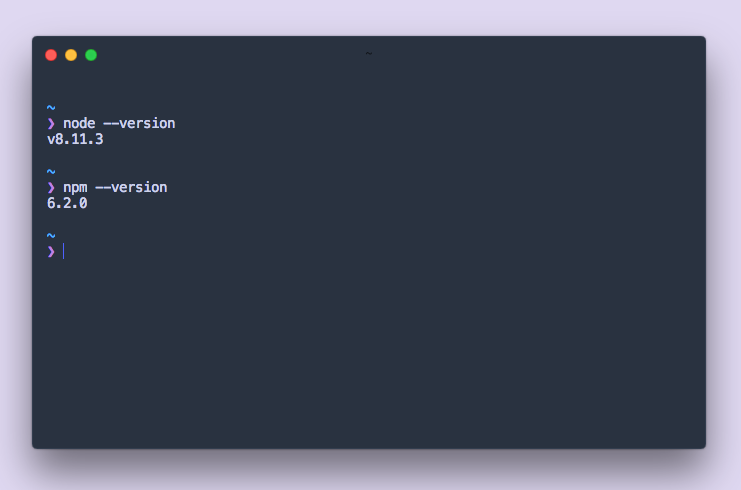
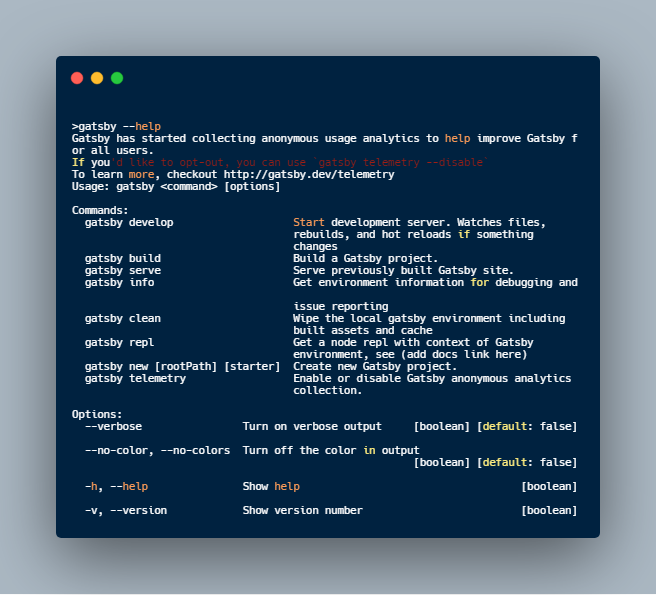
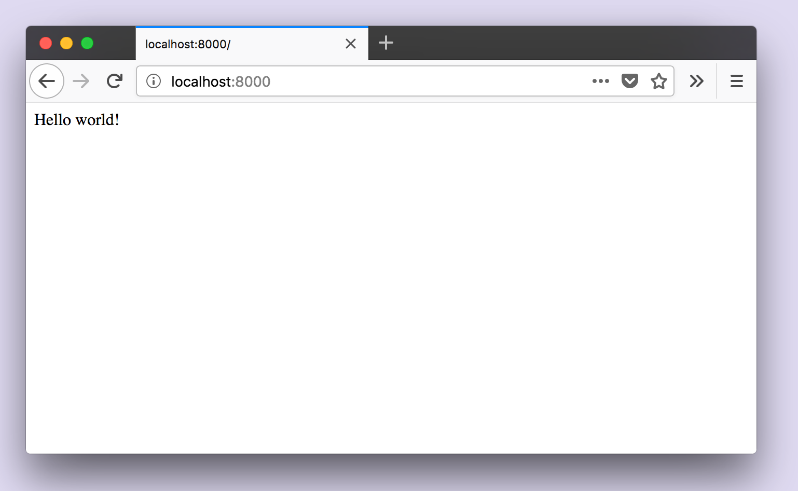

Voordat je begint met het bouwen van je eerste Gatsby-site, moet je jezelf vertrouwd maken met een aantal kernwebtechnologieën en ervoor zorgen dat je alle vereiste software en tools hebt geïnstalleerd.

## Maak jezelf vertrouwd met de command line

De command line is een op tekst gebaseerde interface die wordt gebruikt om opdrachten op je computer uit te voeren. Het wordt ook vaak de terminal genoemd. In deze tutorial gebruiken we beide termen door elkaar. Het lijkt veel op het gebruik van Finder op een Mac of Explorer op Windows. Finder en Explorer zijn voorbeelden van grafische gebruikersinterfaces (GUI). De command line is een krachtige, op tekst gebaseerde manier om met je computer te communiceren.

Neem even de tijd om de command line interface (CLI) van je computer te vinden en te openen. Afhankelijk van het besturingssysteem dat je gebruikt, kun je informatie vinden op de volgende pagina's: [**instructies voor Mac**](http://www.macworld.co.uk/feature/mac-software/how-use-terminal-on-mac-3608274/), [**instructies voor Windows**](https://www.quora.com/How-do-I-open-terminal-in-windows) of [**instructies voor Linux**](https://www.howtogeek.com/140679/beginner-geek-how-to-start-using-the-linux-terminal/).

## Homebrew voor Node.js installeren

Om Gatsby en Node.js te installeren, wordt aanbevolen om [Homebrew](https://brew.sh/) te gebruiken. Een goed begin is het halve werk!

Homebrew op je computer installeren of verifiëren:

1. Open je terminal.
1. Kijk of Homebrew is geïnstalleerd door `brew -v` uit te voeren. je zou "Homebrew" en een versienummer moeten zien.
1. Zo niet, download en installeer dan [Homebrew met de instructies](https://docs.brew.sh/Installation) voor je besturingssysteem (Mac, Linux of Windows).
1. Nadat je Homebrew hebt geïnstalleerd, kun je stap 2 herhalen om de installatie te controleren.

### Mac-gebruikers: installeer Xcode Command Line Tools

1. Open je terminal.
1. Installeer op een Mac Xcode command line programma's door `xcode-select --install` uit te voeren.
      1. Als dat niet lukt, download het dan [rechtstreeks van de Apple-site](https://developer.apple.com/download/more/), nadat je hebt ingelogd met een Apple developer account
1. Wanneer je wordt gevraagd om de installatie te starten, wordt je nog eens gevraagd een softwarelicentie te accepteren voor de daarna nog te downloaden tools.

## ⌚ Installeer Node.js en npm

Node.js is een omgeving die JavaScript-code buiten een webbrowser kan uitvoeren. Gatsby is gebouwd met Node.js. Om aan de slag te gaan met Gatsby, moet je een recente van Node.js versie op je computer hebben geïnstalleerd.

_Opmerking: Gatsby's minimaal ondersteunde Node.js versie is Node 8, maar voel je vrij om een ​​recentere versie te gebruiken._

1. Open je terminal.
1. Voer `brew update` uit om te controleren of je de nieuwste versie van Homebrew hebt.
1. Voer de volgende opdracht uit om Node en npm in één keer te installeren: `brew install node`

Nadat je de installatiestappen hebt gevolgd, controleer je of alles correct is geïnstalleerd:

### Controleer je Node.js-installatie

1. Open je terminal.
2. Voer `node --version` uit. (Als je nieuw bent binnen de command line interface, "Voer `commando` uit", betekent "type `node --version` in de opdrachtprompt en druk op de Enter-toets". Vanaf nu is dat wat we bedoelen met "Voer `commando` uit").
3. Voer `npm --version` uit.

De uitvoer van elk van deze opdrachten zou een moeten versienummer zijn. Je versies zijn mogelijk niet dezelfde als die hieronder worden weergegeven! Als bij het invoeren van deze opdrachten geen versienummer wordt weergegeven, ga je terug naar de vorige stap en controleer je de intallatie van Node.js.



## Installeer Git

Git is een gratis en open source gedistribueerd versiebeheersysteem dat is ontworpen om alles -van kleine tot zeer grote projecten- snel en efficient af te handelen. Wanneer je een "starter"-site van Gatsby installeert, gebruikt Gatsby achter de schermen Git om de vereiste bestanden voor je starter te downloaden en te installeren. Je moet Git geïnstalleerd hebben om je eerste Gatsby-site in te stellen.

De stappen voor het downloaden en installeren van Git zijn afhankelijk van je besturingssysteem. Volg de gids voor je eigen systeem:

- [Git installeren op macOS](https://www.atlassian.com/git/tutorials/install-git#mac-os-x)
- [Git installeren op Windows](https://www.atlassian.com/git/tutorials/install-git#windows)
- [Git installeren op Linux](https://www.atlassian.com/git/tutorials/install-git#linux)

## De Gatsby CLI gebruiken

Met de Gatsby CLI-tool kunt je snel nieuwe Gatsby-sites maken en opdrachten uitvoeren voor het ontwikkelen van Gatsby-sites. Het is als pakket beschikbaar op npm.

De Gatsby CLI is beschikbaar via npm en moet globaal op je systeem worden geïnstalleerd. Dit doe je door het uitvoeren van `npm install -g gatsby-cli`.

_**Opmerking**: wanneer je Gatsby installeert en voor de eerste keer uitvoert, ziet je een kort bericht met informatie over anonieme gebruiksgegevens die worden verzameld voor Gatsby-opdrachten, je kunt meer lezen over hoe die gegevens worden opgehaald en gebruikt in de [telemetrie documentatie](/docs/telemetry)._

Voer `gatsby --help` uit om de beschikbare commando's te zien.



> 💡 Als je de Gatsby CLI niet kunt uitvoeren vanwege een probleem met permissies, kunt je kijken naar [de npm documentatie over het oplossen van permissies](https://docs.npmjs.com/getting-started/fixing-npm-permissions) of [dit stappenplan](https://github.com/sindresorhus/guides/blob/master/npm-global-without-sudo.md).

## Maak een Gatsby-site

Nu ben je klaar om de Gatsby CLI-tool te gebruiken om je eerste Gatsby-site te maken. Met behulp van de tool kun je "starters" (gedeeltelijk gebouwde sites met een standaardconfiguratie) downloaden om je te helpen sneller een bepaald type site te maken. De 'Hallo wereld' starter die je hier zult gebruiken, is een starter met de essentiële benodigdheden die nodig zijn voor een Gatsby-site.

1. Open je terminal.
2. Voer `gatsby new hallo-wereld https://github.com/gatsbyjs/gatsby-starter-hello-world` uit. (_Opmerking: afhankelijk van je downloadsnelheid zal de hoeveelheid tijd die dit kost variëren. Onderstaande gif laat dan ook maar een deel van de installatie zien_).
3. Voer `cd hallo-wereld` uit.
4. Voer `gatsby develop` uit.

<video controls="controls" autoplay="true" loop="true">
  <source type="video/mp4" src="./03-create-site.mp4" />
  <p>Sorry! Je browser ondersteunt deze video niet.</p>
</video>

Wat is er net gebeurd?

```shell
gatsby new hallo-wereld https://github.com/gatsbyjs/gatsby-starter-hello-world
```

- `new` is een gatsby opdracht om een ​​nieuw Gatsby project te maken.
- Hier is 'hallo-wereld' een willekeurige titel - je kunt alles kiezen. De CLI-tool plaatst de code voor uw nieuwe site in een nieuwe map met de naam "hallo-wereld".
- Tenslotte verwijst de opgegeven GitHub-URL naar een code repository met de startercode die je wilt gebruiken.

```shell
cd hallo-wereld
```

- Dit vertaalt zich naar: 'Ik wil map (`cd`) wijzigen in de submap "hallo-wereld". Wanneer je commando's voor je site wilt uitvoeren, moet je je bevinden in de context voor die site (oftewel, je terminal moet zijn geopend in de map waar de code staat).

```shell
gatsby develop
```

- Met deze opdracht wordt een ontwikkelserver gestart. Je zult je nieuwe site kunnen zien en gebruiken in een ontwikkelomgeving - lokaal (op je computer, niet gepubliceerd op internet).

### Bekijk je site lokaal

Open een nieuw tabblad in je browser en ga naar [**http://localhost:8000**](http://localhost:8000/).



Proficiat! Dit is het begin van je allereerste Gatsby-site! 🎉

Je kunt de site lokaal bezoeken op het adres [**_http://localhost:8000_**](http://localhost:8000/) zolang je ontwikkelserver actief is. Dat is het proces dat je begon met het uitvoeren van de opdracht `gatsby develop`. Als je wilt stoppen met het uitvoeren van dat proces (of om te stoppen met het uitvoeren van de ontwikkelserver), ga je terug naar het terminalvenster, houd je de “control” toets ingedrukt en druk je op "c" (ctrl-c). Om het opnieuw te starten, voer je `gatsby develop` opnieuw uit!

**Opmerking:** Als je VM-instellingen zoals `vagrant` gebruikt en/of op je lokale IP-adres wilt inluisteren, voer je `gatsby develop -- --host=0.0.0.0` uit. Nu is de ontwikkelserver zowel op 'localhost' als op je lokale IP adres beschikbaar.

## Stel een code-editor in

Een code editor is een programma dat speciaal is ontworpen voor het bewerken van computercode. Er is een brede selectie aan uitstekende code editors beschikbaar.

### VS Code downloaden

De Gatsby documentatie bevat soms screenshots die zijn genomen in VS Code, dus als je nog geen voorkeur voor een code editor hebt, zorgt VS Code ervoor dat je scherm er uitziet als de screenshots in de tutorial en docs. Als je ervoor kiest VS Code te gebruiken, bezoekt je de [VS Code site](https://code.visualstudio.com/#alt-downloads) en downloadt je de juiste versie voor je platform.

### Installeer de Prettier plugin

We raden ook aan om [Prettier](https://github.com/prettier/prettier) te gebruiken, een hulpmiddel dat helpt bij het opmaken van je code en om fouten te voorkomen.

Je kunt Prettier rechtstreeks in je editor gebruiken met behulp van de [Prettier VS Code plugin](https://github.com/prettier/prettier-vscode):

1. Open de extensieweergave op VS Code (View => Extensions).
2. Zoek naar "Prettier - Code formatter".
3. Klik op "Installeren". (Na de installatie word je gevraagd om VS Code opnieuw te starten om de extensie in te schakelen. Nieuwere versies van VS Code zullen de extensie automatisch inschakelen na het downloaden.)

> 💡 Als je geen VS Code gebruikt, bekijk dan de Prettier-documentatie voor [installatie instructies](https://prettier.io/docs/en/install.html) of [andere editor integraties](https://prettier.io/docs/en/editors.html).

## ➡️ Wat nu?

Samenvattend, in bovenstaande sectie heb je:

- Meer informatie gekeregen over de opdrachtregel en hoe deze te gebruiken
- Node.js en de npm CLI-tool, het versiebeheersysteem Git en de Gatsby CLI-tool geïnstalleerd en geleerd te gebruiken
- Een nieuwe Gatsby-site gegenereerd met behulp van de Gatsby CLI-tool
- De Gatsby ontwikkelserver uitgevoerd en je hebt je site lokaal bezocht
- Een code editor gedownload
- Een codeformatter -Prettier- geïnstalleerd

Ga nu verder met [**kennismaken met Gatsby-bouwstenen**](/tutorial/part-one/).

## Referenties

### Overzicht van kerntechnologieën

Het is niet nodig om hier al een expert in te zijn - dus als je dat niet bent, maak je geen zorgen! Je zult veel leren in de loop van deze tutorialserie. Dit zijn enkele van de belangrijkste webtechnologieën die je gaat gebruiken bij het bouwen van een Gatsby-site:

- **HTML**: een opmaaktaal die elke webbrowser kan begrijpen. De afkorting staat voor HyperText Markup Language. HTML geeft je website een universele informatiestructuur en definieert zaken als koppen, alinea's en meer.
- **CSS**: een presentatietaal die wordt gebruikt om het uiterlijk van je website (lettertypen, kleuren, lay-out, enz.) op te maken. De afkorting staat voor Cascading Style Sheets.
- **JavaScript**: een programmeertaal die ons helpt het web dynamisch en interactief te maken.
- **React**: een codebibliotheek (gebouwd met JavaScript) voor het bouwen van gebruikersinterfaces. Dit is het framework dat Gatsby gebruikt om pagina's te bouwen en inhoud te structureren.
- **GraphQL**: een zoektaal waarmee je gegevens naar je website kunt halen. Het is de interface die Gatsby gebruikt voor het beheer van sitegegevens.

### Wat is een website?

Voor een uitgebreide introductie over wat een website is - inclusief een inleiding tot HTML en CSS - bekijk je “[**Building your first web page**](https://learn.shayhowe.com/html-css/building-your-first-web-page/)”. Het is een geweldige plek om te leren over het internet. Voor een wat meer praktische introductie tot [**HTML**](https://www.codecademy.com/learn/learn-html), [**CSS**](https://www.codecademy.com/learn/learn-css) en [**JavaScript**](https://www.codecademy.com/learn/introduction-to-javascript), bekijk de tutorials van Codecademy. [**React**](https://reactjs.org/tutorial/tutorial.html) en [**GraphQL**](http://graphql.org/graphql-js/) hebben ook hun eigen inleidende tutorials .

### Meer informatie over de command line interface

Voor een geweldige introductie over het gebruik van de command line interface, bekijk [**Codecademy’s Command Line tutorial**](https://www.codecademy.com/courses/learn-the-command-line/lessons/navigation/exercises/your-first-command) voor Mac- en Linux-gebruikers, en [**deze tutorial**](https://www.computerhope.com/issues/chusedos.htm) voor Windows-gebruikers. Zelfs als je een Windows-gebruiker bent, is de eerste pagina van de Codecademy tutorial waardevol. Het legt uit wat de opdrachtregel is, niet alleen hoe ermee te communiceren.

### Meer informatie over npm

Npm is een JavaScript-pakketbeheerder. Een pakket is een codemodule die je kunt kiezen om in je projecten op te nemen. Als je zojuist Node.js hebt gedownload en geïnstalleerd, is npm automatisch geïnstalleerd!

Npm heeft drie verschillende componenten: de npm-website, het npm-register en de npm-command line interface (CLI).

- Op de npm-website kun je navigeren door alle JavaScript-pakketten die beschikbaar zijn in het npm-register.
- Het npm-register is een grote database met informatie over JavaScript-pakketten die beschikbaar zijn op npm.
- Zodra je een gewenst pakket hebt geïdentificeerd, kun je de npm CLI gebruiken om het in je project of globaal te installeren (net zoals andere CLI-tools). De npm CLI is de interface die praat met het register - je werkt over het algemeen alleen met de npm-website of de npm CLI.

> 💡 Bekijk de introductie van npm, "[**What is npm?**](https://docs.npmjs.com/getting-started/what-is-npm)".

### Meer informatie over Git

Je hoeft Git niet te kennen om deze tutorial te voltooien, maar het is een zeer handige tool. Als je meer wilt weten over versiebeheer, Git en GitHub, bekijk dan GitHub's [Git Handbook](https://guides.github.com/introduction/git-handbook/).
